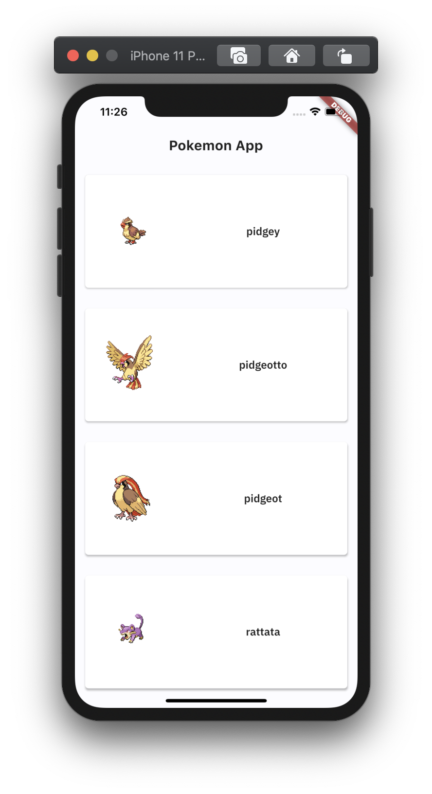
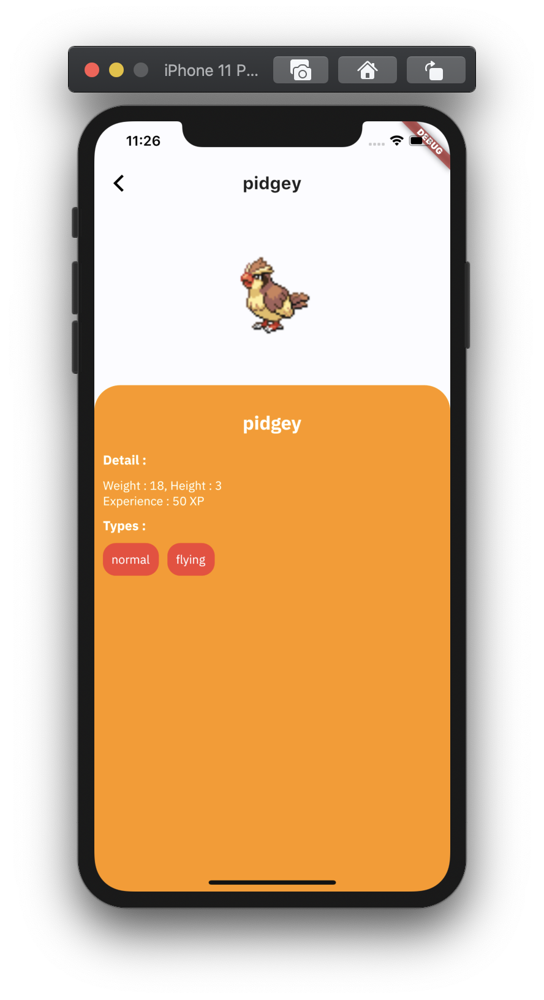

# Pokemon App


[](https://codemagic.io/apps/5ec63ade43c9304d454e75e7/5ec64f3243c9304d454e7682/latest_build)
[](LICENSE)
[](https://flutter.dev/)
[](https://github.com/rrifafauzikomara/MovieCatalogue)


## 📸 Example iOS
<pre>
     
</pre>


## Quick start
This is a normal flutter app. You should follow the instructions in the [official documentation](https://flutter.io/docs/get-started/install).
This project uses **BLoC** (business logic component) to separate the business logic with UI itself.
It's recommended to do self-study about it before jumping into the project [here](https://bloclibrary.dev/).
And also on this project uses **Modularization** approach to separate each feature ([core](https://github.com/rrifafauzikomara/MovieCatalogue/tree/master/core), [shared](https://github.com/rrifafauzikomara/MovieCatalogue/tree/master/shared), [ui](https://github.com/rrifafauzikomara/MovieCatalogue/tree/master/lib/ui) modules).
You can do self-study about it in [here](https://medium.com/flutter-community/mastering-flutter-modularization-in-several-ways-f5bced19101a).


## Modularization Structure 🔥

    # Root Project
    .
    ├── core                   # Name of module (new package)
    │   ├── bloc               # Business logic component.
    │   └── network            # Remote Data Handlers
    |       ├── api            # Http request to get the data from the internet.
    │       └── model          # Model / POJO.
    |
    ├── lib                    # Name of module (default from Flutter)
    │   └── ui                 # Activity/View layer
    |
    └── shared                 # Name of module (new package)
        ├── common             # Common shared.
        │   ├── styles         # Custom style that will be used on each widget.
        │   └── utils          # Utility classes.
        └── widget             # Custom widget which can be used repeatedly.


## Author

* **R Rifa Fauzi Komara**

Don't forget to follow me, fork and give me a ⭐


## License

```
MIT License

Copyright (c) [2020] [R Rifa Fauzi Komara]

Permission is hereby granted, free of charge, to any person obtaining a copy
of this software and associated documentation files (the "Software"), to deal
in the Software without restriction, including without limitation the rights
to use, copy, modify, merge, publish, distribute, sublicense, and/or sell
copies of the Software, and to permit persons to whom the Software is
furnished to do so, subject to the following conditions:

The above copyright notice and this permission notice shall be included in all
copies or substantial portions of the Software.

THE SOFTWARE IS PROVIDED "AS IS", WITHOUT WARRANTY OF ANY KIND, EXPRESS OR
IMPLIED, INCLUDING BUT NOT LIMITED TO THE WARRANTIES OF MERCHANTABILITY,
FITNESS FOR A PARTICULAR PURPOSE AND NONINFRINGEMENT. IN NO EVENT SHALL THE
AUTHORS OR COPYRIGHT HOLDERS BE LIABLE FOR ANY CLAIM, DAMAGES OR OTHER
LIABILITY, WHETHER IN AN ACTION OF CONTRACT, TORT OR OTHERWISE, ARISING FROM,
OUT OF OR IN CONNECTION WITH THE SOFTWARE OR THE USE OR OTHER DEALINGS IN THE
SOFTWARE.
```